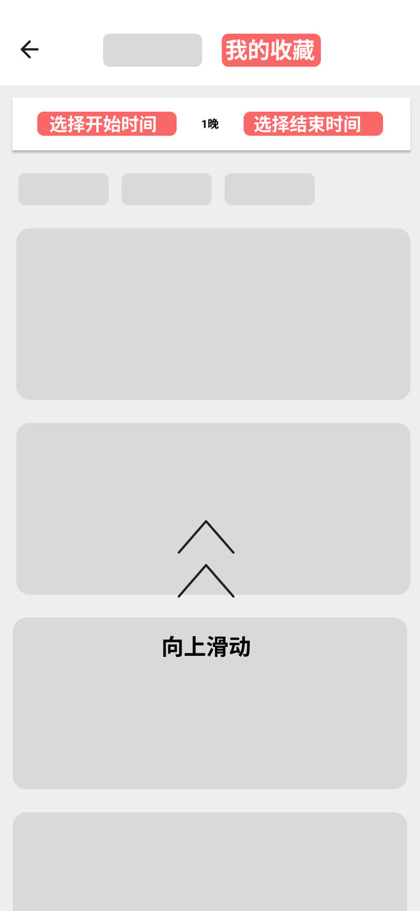

---

#### 条件
1. 手机已经越狱
2. 手机上已安装助手App
3. 手机上已经安装了旅行App，并且已登录。

#### 步骤

1.打开旅行App，点击左上角 **【酒店】** 按钮。

2.跳转到酒店首页后，点击底部第二个 **【购物车/收藏】** 按钮。

3.跳转到收藏页面后，点击顶部的 **【我的收藏】**按钮切换到收藏，并选择任务的 **【时间范围】**，**向上滑动** 收藏列表，直到滑动到 **【无更多数据】** 即完成。

