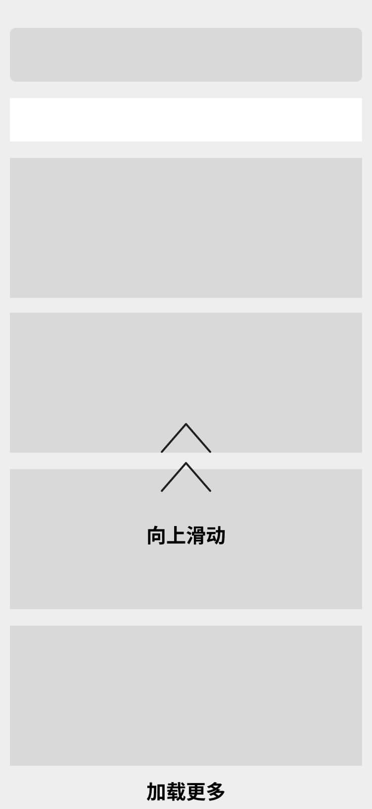

#### 条件
1. 手机已经越狱
2. 手机上已安装助手App
3. 手机上已经安装了旅行App，并且已登录。

#### 步骤

1.打开旅行App，点击左上角 **【酒店】** 按钮。

2.跳转到酒店首页后，选择任务 **【城市】** ，选择任务 **【时间】**， 点击 **【查询】**。

3.跳转到搜索页面后，点击右上角 **【筛选】**，选择任务 **【分类】**和 **【选项】**，如果有多个就选择多个条件，完成选择后点击 **【完成】**按钮。

4.跳转到搜索结果的列表，直接 **向上滑动** 查看，滑动到任务的要求 **页数**或 **条数**即完成任务。

